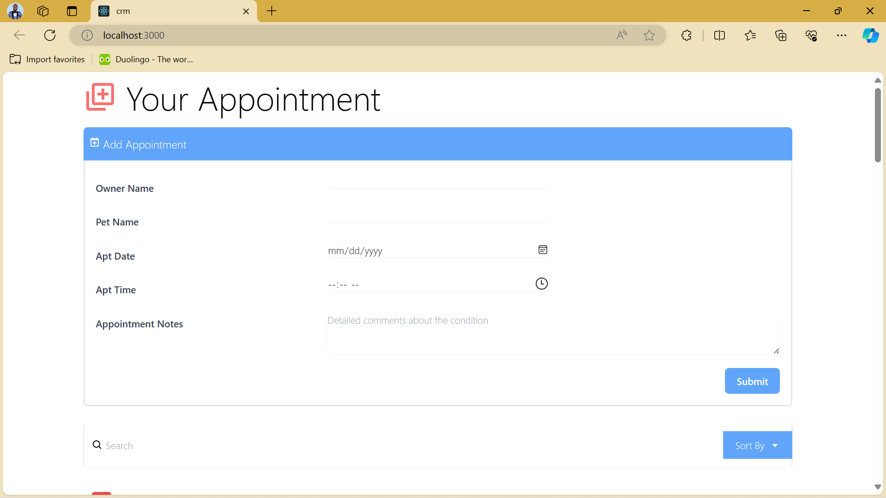

# Appointment Management System

This project is an appointment management system built with React. It allows users to add, search, and delete appointments. The system also includes sorting functionality to sort appointments by pet name, owner name, and appointment date.

## Features

- Add new appointments with owner name, pet name, appointment date, and notes.
- Search appointments by pet name, owner name, appointment date, and notes.
- Delete appointments.
- Sort appointments by pet name, owner name, and appointment date in ascending or descending order.

## Installation

To run this project locally, follow these steps:

1. Clone the repository:
   ```bash
   git clone https://github.com/ajewoleOlugbenga/crm-calendar

##Navigate to the project directory:
bash
Copy code
cd crm-calendar
Install dependencies:
bash
Copy code
npm install
Start the development server:
bash
Copy code
npm start
Open http://localhost:3000 to view the app in your browser.
##Usage
To add a new appointment, click the "Add Appointment" button and fill out the form.
Use the search bar to filter appointments based on pet name, owner name, appointment date, and notes.
Click the trash icon next to an appointment to delete it.
Click the "Sort By" button to sort appointments by pet name, owner name, or appointment date in ascending or descending order.
##Technologies Used
React
React Icons
Tailwind CSS
## Screenshots


.png)
.png)
.png)
.png)


